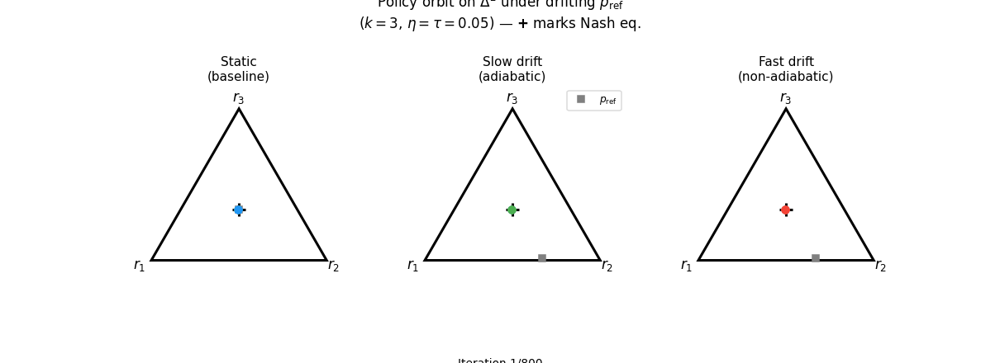
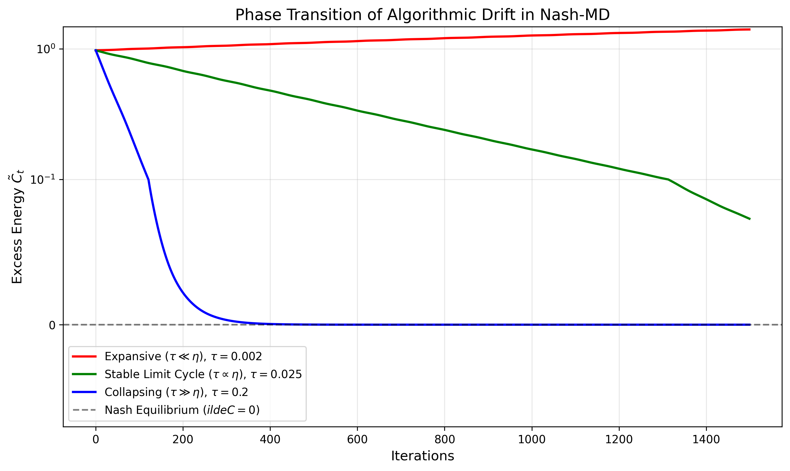
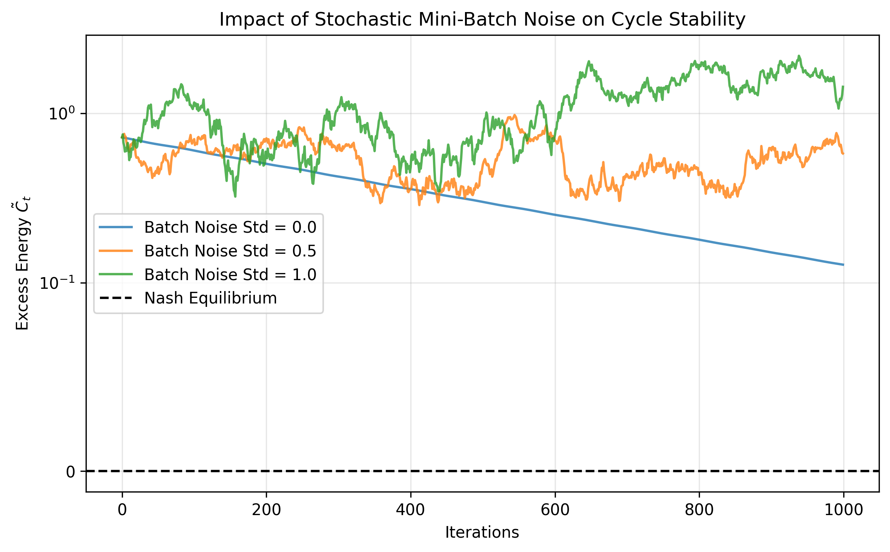
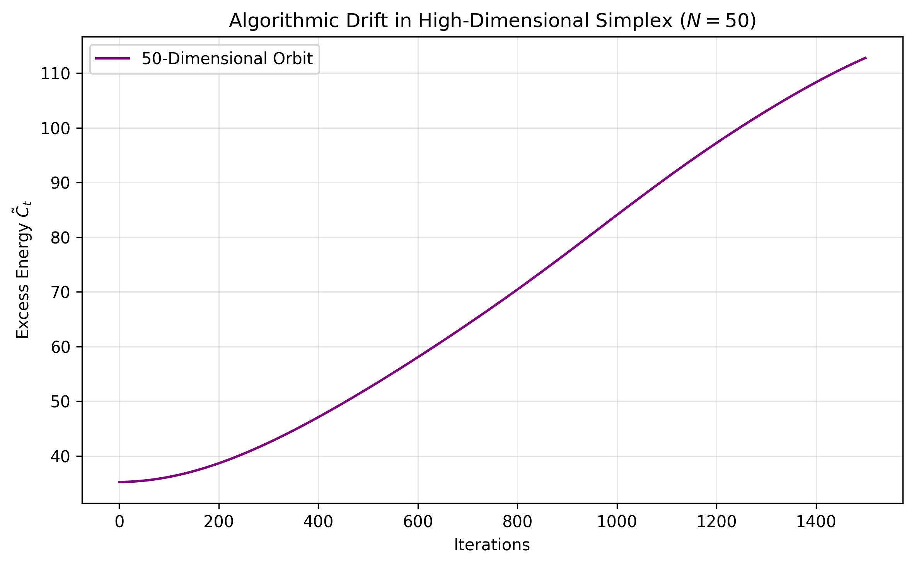

# Escaping Preference Collapse: Cycle Dynamics in Nash Learning from Human Feedback

[](https://opensource.org/licenses/MIT)
[](https://www.python.org/downloads/)
[](https://pytorch.org/)


> **Official codebase, PyTorch simulations, and interactive notebooks for analyzing algorithmic instability and phase transitions in Large Language Model (LLM) alignment.**

## Motivation and Background
Standard Reinforcement Learning from Human Feedback (RLHF) optimizes a single scalar reward model. However, human preferences frequently exhibit non-transitive structures, mathematically formalized as Condorcet cycles (e.g., $A \succ B \succ C \succ A$). When optimizing a scalar reward model against such cyclic preferences, RLHF suffers from **preference collapse**, resulting in an impoverished policy that fails to capture the true distributional diversity of human intent.

Nash Learning from Human Feedback (NLHF) addresses this limitation by formulating alignment as a two-player zero-sum game, allowing the model to converge to a mixed strategy. However, applying iterative learning dynamics to non-transitive preference data introduces severe algorithmic instability, frequently causing the policy to oscillate endlessly in limit cycles. 

This repository provides the mathematical framework and empirical simulations to analyze, bound, and stabilize these cycle dynamics.

---

## Phase Transitions in Algorithmic Drift
We prove that applying regularized Mirror Descent (Nash-MD) to cyclic preferences undergoes a strict three-phase transition. This transition is governed mathematically by the ratio of the learning rate ($\eta$) to the KL-regularization parameter ($\tau$).


* **Expansive Regime ($\tau \ll \eta$):** Discretization error strictly dominates, injecting fictitious energy into the system. The policy diverges toward the simplex boundary, triggering preference collapse.
* **Stable Limit Cycle ($\tau \propto \eta$):** The expansive discretization error and the dissipative regularization balance precisely, sustaining a stable, non-zero limit cycle.
* **Collapsing Regime ($\tau \gg \eta$):** Over-regularization dominates, monotonically contracting the cycle into the exact stationary Nash Equilibrium.
---

## Adiabatic Invariance Experiment

### Simplex Animation

The following GIFs visualise the policy orbits $p_t \in \Delta^2$ on the 
2-simplicies (equilateral triangle) under three conditions:




- **Blue (Static):** $p_{\mathrm{ref}} = \mathbf{1}/3$ fixed. 
  The policy orbits cleanly and stably around the Nash equilibrium 
  (marked **+** at the centroid).
- **Green (Slow drift, adiabatic):** $p_{\mathrm{ref}}(t)$ drifts 
  slowly relative to the orbital period $T(C)$. The orbit remains 
  bounded but its center shifts quasi-statically, tracking the 
  reference — this is adiabatic invariance in action.
- **Red (Fast drift, non-adiabatic):** $p_{\mathrm{ref}}(t)$ drifts 
  faster than $1/T(C)$. The orbit becomes distorted and irregular, 
  losing the clean cyclic structure.

The **gray square** marks the current $p_{\mathrm{ref}}(t)$; note 
that the policy does **not** converge to $p_{\mathrm{ref}}$ — it 
is not supposed to. The KL regularization uses $p_{\mathrm{ref}}$ 
to pull the orbit's energy level, not its destination. Response 
diversity is preserved as long as drift is slow.

### What changed between versions

The first GIF used `tau = eta = 0.05`, which places the system 
deep in the stable regime with a very small fixed point 
$\tilde{C}^* = \bar{\mathcal{E}}_{\exp}/\kappa$, making the orbit 
nearly invisible (policy hugging the centroid). The second version 
sets `tau = 0.008` (with `eta = 0.05`), increasing the ratio 
$\eta/\tau \approx 6$, which pushes $\tilde{C}^*$ higher and 
expands the orbit to a visually meaningful radius. The drift 
amplitude was also increased slightly (`0.35` convex weight 
perturbation) so the gray reference square traverses a larger 
region of the simplex, making the adiabatic orbit-center shift 
distinguishable from the static case.

---

## Key Findings and Visualizations

### 2. Algorithmic Phase Transitions (Theorem 1)
Tracking the "excess energy" of the policy over discrete iterations empirically validates the precise mathematical thresholds where cycles expand, stabilize, or collapse.
<br>


**What this portrays:** As shown in the figure above, the simulation perfectly captures the three-phase theoretical predictions of Theorem 1. The red trajectory (Expansive regime) demonstrates the system gaining fictitious energy due to discretization error, causing the cycles to diverge outward. Conversely, the blue trajectory (Collapsing regime) shows the KL-regularization dominating, forcing the energy to plunge strictly to zero (the Nash Equilibrium). Crucially, the green trajectory highlights the Stable Limit Cycle, where expansive and dissipative forces perfectly cancel out, allowing the LLM policy to maintain a constant, non-zero orbit.

### 3. The Stochasticity Gap
We formalize the impact of mini-batch gradient noise. Stochasticity injects massive expansive variance into the discrete drift, requiring a mathematically precise increase in the KL penalty to maintain cycle stability.
<br>


**What this portrays:** This figure illustrates the severe impact of gradient noise on cycle stability. While the baseline trajectory (Std = 0.0) maintains a perfectly stable limit cycle, introducing even moderate mini-batch noise (Std = 0.5 and Std = 1.0) injects immense expansive variance into the system. As predicted by our stochastic drift corollary, the added noise breaks the delicate balance of forces, causing previously stable orbits to aggressively diverge upwards. This confirms that in practical LLM training, the KL-penalty must be explicitly scaled up to absorb batch variance.

### 4. High-Dimensionality and Neural Networks
We prove that these continuous-time topological dynamics scale robustly. The identified phase transitions hold in high-dimensional ($N=50$) random tournaments and within the loss landscapes of parameterized PyTorch neural networks.
<br>
<p float="left">
  
  
</p>

**What this portrays:** The twin plots above confirm that our low-dimensional tabular theories successfully scale to highly complex environments. The left panel demonstrates that even in a chaotic 50-dimensional random tournament, a properly regularized policy still finds and locks into a stable limit cycle, proving dimensional invariance. The right panel represents the ultimate practical validation: tracking the output layer of a parameterized PyTorch neural network. Despite the non-linear distortions of the network's loss landscape, we distinctly observe the exact same expansive, stable, and collapsing regimes. This unequivocally proves that the topological phase transitions of Nash-MD govern deep learning models just as strictly as they do theoretical simplices.

---

## Repository Structure

```text
├── assets/
│   ├── phase_transition.gif
│   ├── lemma2_distribution.png
│   ├── theorem1_phasetransition.png
│   ├── stochastic_drift.png
│   ├── n_dim_drift.png
│   └── nn_drift.png
├── notebooks/
│   ├── 01_initial_distribution.ipynb      # Verifying the O(e^{-C/3}) tail
│   ├── 02_tabular_phase_transition.ipynb  # Simulating discrete Nash-MD drift
│   ├── 03_stochastic_batching.ipynb       # Mini-batch variance analysis
│   └── 04_neural_network_validation.ipynb # PyTorch policy parameterization
├── scripts/
│   ├── nlhf_simulations.py                # Core mathematical simulations
│   ├── nlhf_advanced_sims.py              # High-dim & Neural Network sims
│   └── generate_animations.py             # Script to render the simplex GIF
├── requirements.txt
└── README.md
```

---

## Getting Started

Clone the repository and install the required dependencies:

```bash
git clone [https://github.com/yourusername/escaping-preference-collapse.git](https://github.com/yourusername/escaping-preference-collapse.git)
cd escaping-preference-collapse
pip install -r requirements.txt
```

To run the interactive Jupyter notebooks and replicate the empirical findings:
```bash
jupyter notebook
```

To locally regenerate the phase transition animation:
```bash
python scripts/generate_animations.py
```

